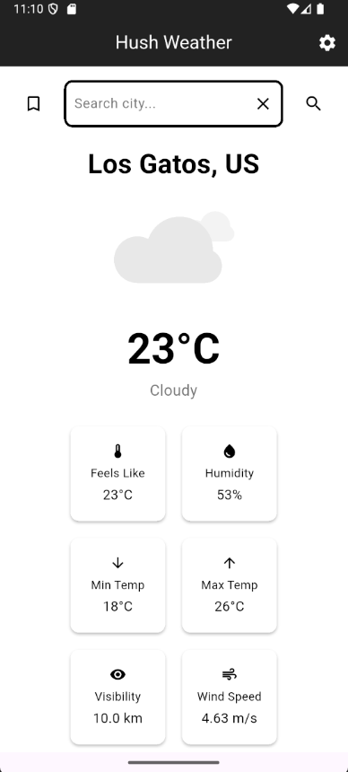
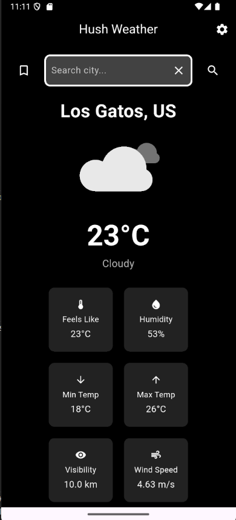
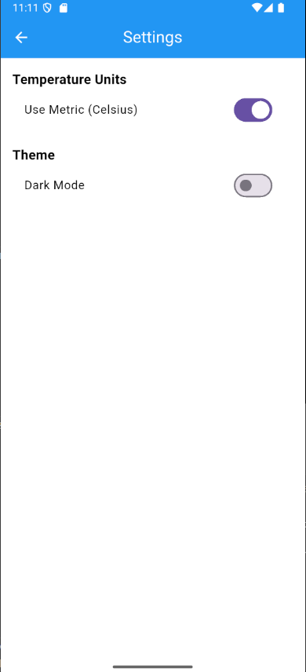
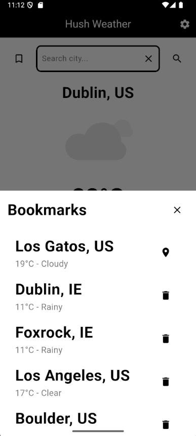

# Hush Weather 🌦️

Hush Weather is a Flutter-based weather application that provides real-time weather updates for cities around the world. It features a clean and intuitive user interface, supports both metric and imperial units, and includes a dark mode for better usability in low-light environments.

## Features

- **Search Weather by City**: Search for weather information by entering a city name.
- **Current Location Weather**: Automatically fetch weather data for the user's current location.
- **Bookmarks**: Save favorite cities for quick access to their weather information.
- **Dark Mode**: Toggle between light and dark themes.
- **Unit Conversion**: Switch between metric (Celsius) and imperial (Fahrenheit) units.
- **Weather Animations**: Display dynamic animations based on weather conditions (e.g., sunny, cloudy, rainy).
- **Offline Support**: Bookmarked cities are saved locally using `SharedPreferences`.

## Screenshots

### 🌞 Light Mode


---

### 🌙 Dark Mode


---

### ⚙️ Settings Page


---

### 🔖 Bookmarks



## Getting Started

### Prerequisites

- [Flutter SDK](https://flutter.dev/docs/get-started/install) installed on your machine.
- An API key from [OpenWeatherMap](https://openweathermap.org/api) for fetching weather data.

### Installation

1. Clone the repository:
   ```bash
   git clone https://github.com/your-username/hush-weather.git
   cd hush-weather
   ```

2. Install dependencies:
   ```bash
   flutter pub get
   ```

3. Add your OpenWeatherMap API key:
   - Open `lib/pages/weather_page.dart`.
   - Replace the placeholder API key in the `WeatherService` initialization:
     ```dart
     final _weatherService = WeatherService('YOUR_API_KEY_HERE');
     ```

4. Run the app:
   ```bash
   flutter run
   ```

## Project Structure

```
flutter_application_1/
├── lib/
│   ├── pages/
│   │   ├── weather_page.dart       # Main weather page
│   │   ├── settings_page.dart      # Settings page for unit and theme preferences
│   ├── services/
│   │   ├── weather_service.dart    # Handles API calls to OpenWeatherMap
│   ├── helpers/
│   │   ├── shared_preferences_helper.dart # Helper for saving/loading data locally
│   ├── models/
│   │   ├── weather_model.dart      # Weather data model
│   ├── utils/
│   │   ├── weather_utils.dart      # Utility functions for weather conditions
├── assets/
│   ├── sun.json                   # Animation for sunny weather
│   ├── cloudy.json                # Animation for cloudy weather
│   ├── rain.json                  # Animation for rainy weather
│   ├── thunder.json               # Animation for thunderstorms
│   ├── snow.json                  # Animation for snowy weather
│   ├── fog.json                   # Animation for foggy weather
```

## Key Components

### WeatherPage
The main page of the app, where users can:
- View current weather details.
- Search for weather in other cities.
- Access bookmarks and settings.

### SettingsPage
Allows users to:
- Toggle between metric and imperial units.
- Enable or disable dark mode.

### WeatherService
Handles API calls to fetch weather data from OpenWeatherMap.

### SharedPreferencesHelper
Manages local storage for bookmarks and user preferences.

## Dependencies

- [Flutter](https://flutter.dev/)
- [Lottie](https://pub.dev/packages/lottie) for animations
- [SharedPreferences](https://pub.dev/packages/shared_preferences) for local storage
- [Geolocator](https://pub.dev/packages/geolocator) for location services
- [Geocoding](https://pub.dev/packages/geocoding) for reverse geocoding
- [HTTP](https://pub.dev/packages/http) for API requests

## Contributing

Contributions are welcome! Please fork the repository and submit a pull request with your changes.

## License

This project is licensed under the MIT License. See the [LICENSE](LICENSE) file for details.

## Acknowledgments

- [OpenWeatherMap](https://openweathermap.org/) for providing weather data.
- [LottieFiles](https://lottiefiles.com/) for weather animations.
